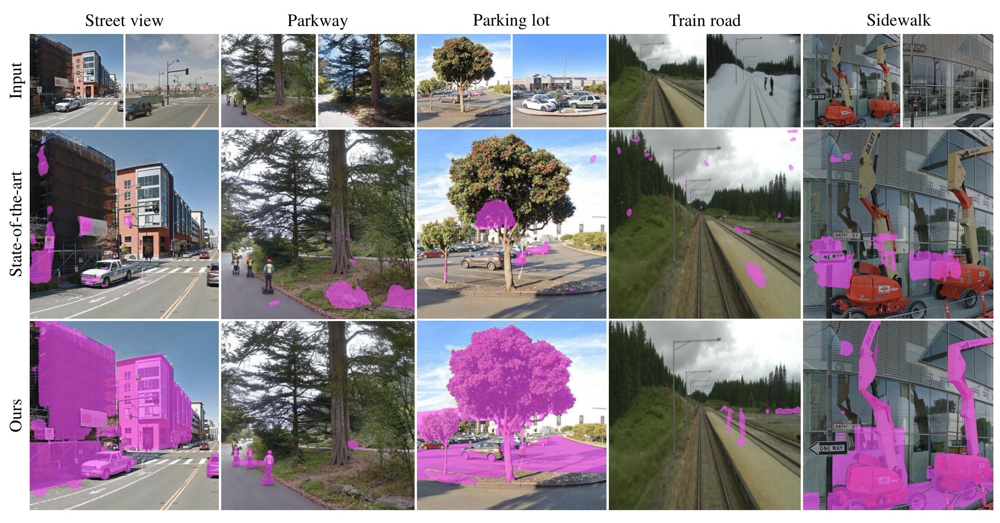
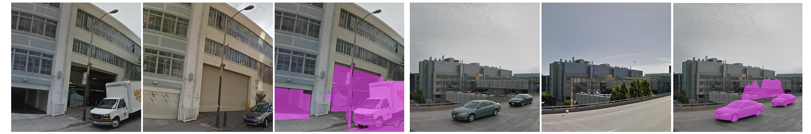
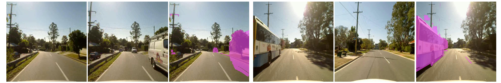
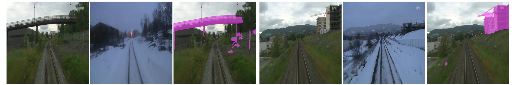
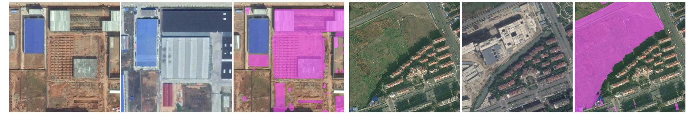

# Towards Generalizable Scene Change Detection

This repository represents the official implementation of the paper titled "Towards Generalizable Scene Change Detection (CVPR 2025)".

[](https://arxiv.org/abs/2409.06214)
[](https://www.apache.org/licenses/LICENSE-2.0)
[](https://cvpr.thecvf.com/virtual/2025/poster/34711)
[](https://paperswithcode.com/sota/scene-change-detection-on-changevpr?p=towards-generalizable-scene-change-detection)

<p align="center">
  <a href="https://1124jaewookim.github.io/"><strong>Jaewoo Kim</strong></a>
  ·  
  <a href="https://uehwan.github.io/people/Ue-Hwan-Kim/"><strong>Uehwan Kim</strong></a>
  <br>
  <strong>CVPR 2025</strong>
</p>

<div align='center'>
  <br>
  <br>Comparative results of the current state-of-the-art model and our GeSCF on various unseen images.
</div>

## :bulb: Problem Formulation

We formulate the research problem by casting a fundamental question: **"Can contemporary SCD models detect arbitrary real-world changes beyond the scope of research data?"**
Our findings, as shown in the figure above, indicate that their reported effectiveness does not hold in real-world applications. Specifically, we observe that they (1) <ins>produce inconsistent change masks</ins> when the input order is reversed, and (2) <ins>exhibit significant performance drops</ins> when deployed to unseen domains with different visual features.

In this work, we address these two pivotal SCD problems by proposing a novel framework (_GeSCF_) and a novel benchmark (_GeSCD_) to foster SCD research in generalizability.

## 🔧 Installation

Follow the steps below to set up the environment for running **GeSCF**:

### 1. Clone this repository

```bash
git clone https://github.com/1124jaewookim/towards-generalizable-scene-change-detection.git
cd towards-generalizable-scene-change-detection/src
```

### 2. Install required dependencies

You can install dependencies manually or using a `requirements.txt` file.

### 3. Download pretrained weights

- **Segment Anything (SAM):**  
  Download from the official Meta AI repository:  
  👉 https://github.com/facebookresearch/segment-anything  
  Place the downloaded SAM ViT checkpoints (e.g., `sam_vit_h_4b8939.pth`) in the `src/pretrained_weight/` directory.

- **SuperPoint:**  
  Download pretrained weights from:  
  👉 https://github.com/magicleap/SuperPointPretrainedNetwork  
  Place them in the corresponding directory specified in the `src/pretrained_weight/` directory.

## 🗂 Datasets

For a comprehensive evaluation of SCD performance, we consider three standard SCD datasets with different characteristics and our proposed **ChangeVPR** dataset.

Please follow this <a href="https://huggingface.co/datasets/Flourish/VL-CMU-CD/blob/main/VL-CMU-CD-binary255.zip"><strong>page</strong></a> to download the VL-CMU-CD dataset.

Please follow this <a href="https://kensakurada.github.io/pcd_dataset.html"><strong>page</strong></a> to download the TSUNAMI dataset.

Please follow this <a href="https://github.com/SAMMiCA/ChangeSim"><strong>page</strong></a> to download the ChangeSim dataset.

To download our **ChangeVPR** dataset, go <a href="https://docs.google.com/forms/d/e/1FAIpQLSeTYO0D5p1jEc5NlYbKR9xWkd8NSXzLCCCLR3OTlQ2LPCZk2Q/viewform?usp=sharing"><strong>here</strong></a> to download it.

### 📁 Dataset Structure

Prepare your dataset in the following structure:

```text
your_dataset_root/
└── ChangeVPR/
    └── SF-XL/
        ├── t0/               # Images at time t0 
        │   ├── 00000000.png
        │   ├── 00000001.png
        │   └── ...
        ├── t1/               # Images at time t1
        │   ├── 00000000.png
        │   ├── 00000001.png
        │   └── ...
        └── mask/             # Ground-truth binary change masks
            ├── 00000000.png
            ├── 00000001.png
            └── ...
```
or
```text
your_dataset_root/
└── VL_CMU_CD/
    └── test/
        ├── t0/               # Images at time t0
        │   ├── 000_1_00_0.png
        │   ├── 000_1_01_0.png
        │   └── ...
        ├── t1/               # Images at time t1
        │   ├── 000_1_00_0.png
        │   ├── 000_1_01_0.png
        │   └── ...
        └── gt/               # Ground-truth binary change masks
            ├── 000_1_00_0.png
            ├── 000_1_01_0.png
            └── ...
```

## 🚀 Inference on Dataset

To run inference on an entire dataset, use the following command [`src/test.sh`](src/test.sh) for convenience:

```bash
CUDA_VISIBLE_DEVICES=0 python test.py \
    --test-dataset VL_CMU_CD \
    --output-size 512 \
    \
    --dataset-path F:/GeSCD/VL_CMU_CD/test \
    \
    --feature-facet key \
    --feature-layer 17 \
    --embedding-layer 32 \
    \
    --sam-backbone vit_h \
    --pseudo-backbone vit_h \
    \
    --points-per-side 32 \
    --pred-iou-thresh 0.7 \
    --stability-score-thresh 0.7
```

📌 **Note**

| Argument                  | Description |
|---------------------------|-------------|
| `--test-dataset`          | Dataset name (e.g., `VL_CMU_CD`, `ChangeVPR`, `TSUNAMI`) |
| `--dataset-path`          | Path to the dataset root directory |
| `--output-size`           | Final resolution of the output change mask |
| `--feature-facet`         | Which ViT token to extract (`key`, `query`, or `value`) |
| `--feature-layer`         | ViT layer to extract features from |
| `--embedding-layer`       | ViT layer to extract token embeddings for similarity |
| `--sam-backbone`          | Backbone used in Segment Anything (e.g., `vit_h`, `vit_l`, `vit_b`) |
| `--pseudo-backbone`       | Backbone used in the pseudo mask generator |
| `--points-per-side`       | Controls the sampling density for SAM proposals |
| `--pred-iou-thresh`       | Higher value → fewer but more confident masks |
| `--stability-score-thresh`| Higher value → fewer but more stable masks |

⚡ **Tips for Faster Inference**
- Use smaller backbones:  
  Replace `vit_h` with `vit_l` or `vit_b` for `--sam-backbone` and `--pseudo-backbone`.
- Reduce `--points-per-side` to `16` for fewer region proposals.
- Increase `--pred-iou-thresh` and `--stability-score-thresh` to filter out weak or noisy masks.

> 🏆 However, the best performance reported in the paper was achieved using:  
> `--sam-backbone vit_h`, `--pseudo-backbone vit_h`, `--points-per-side 32`,  
> `--pred-iou-thresh 0.7`, and `--stability-score-thresh 0.7`.

## 🖼️ Inference on Single Image Pair

To run inference on a single image pair (e.g., for visualization or quick testing), use the following command:

> 📌 Make sure to set `--test-dataset` to `Random` when testing with a manually specified image path.

```bash
CUDA_VISIBLE_DEVICES=0 python test_single.py \
    --test-dataset Random \
    --output-size 512 \
    \
    --img-t0-path F:/GeSCD/ChangeVPR/SF-XL/t0/00000001.png \
    --img-t1-path F:/GeSCD/ChangeVPR/SF-XL/t1/00000001.png \
    --gt-path   F:/GeSCD/ChangeVPR/SF-XL/mask/00000001.png \
    \
    --feature-facet key \
    --feature-layer 17 \
    --embedding-layer 32 \
    \
    --sam-backbone vit_h \
    --pseudo-backbone vit_h \
    \
    --points-per-side 32 \
    --pred-iou-thresh 0.7 \
    --stability-score-thresh 0.7
```

> 📝 The ground-truth mask (`--gt-path`) is optional.  
> If provided, precision/recall/F1 will be calculated and logged.

## 🎨 Demo

Our GeSCF, as a SAM-based **zero-shot framework**, demonstrates exceptional robustness across a wide range of terrain conditions, extending even to challenging remote sensing change detection scenarios. Below are examples showing the triplets of t0, t1, and GeSCF's corresponding predictions.

<div align='center'>
  <br>
  <br>Qualitative results of the GeSCF on ChangeVPR SF-XL (urban) split.
</div>

<div align='center'>
  <br>
  <br>Qualitative results of the GeSCF on ChangeVPR St Lucia (suburban) split.
</div>

<div align='center'>
  <br>
  <br>Qualitative results of the GeSCF on ChangeVPR Nordland (rural) split.
</div>

<div align='center'>
  <br>
  <br>Qualitative results of the GeSCF on SECOND (test) benchmark.
</div>

## 🎖 Acknowledgement

We sincerely thank <a href="https://github.com/kensakurada/sscdnet"><strong>CSCDNet</strong></a>, <a href="https://github.com/kensakurada/sscdnet"><strong>CDResNet</strong></a>, <a href="https://github.com/Herrccc/DR-TANet"><strong>DR-TANet</strong></a> and <a href="https://github.com/DoctorKey/C-3PO/tree/main"><strong>C-3PO</strong></a> for providing a strong benchmark of the SCD baselines. We also thank
<a href="https://github.com/facebookresearch/segment-anything"><strong>Segment Anything</strong></a>
for providing an excellent vision foundation model.

## 📃 Citation

If you find the work useful for your research, please cite:

```bibtex
@inproceedings{Kim2024TowardsGS,
  title={Towards Generalizable Scene Change Detection},
  author={Jaewoo Kim and Uehwan Kim},
  booktitle={Proceedings of the IEEE/CVF Conference on Computer Vision and Pattern Recognition},
  year={2025}
}

```
